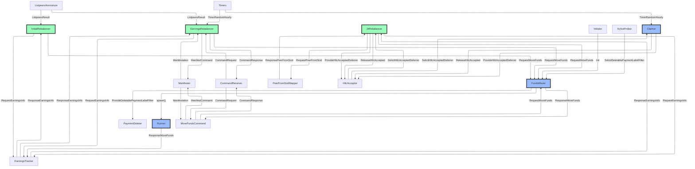

# CLBOSS Channel Balancing

```mermaid
   %%{init: {"flowchart": {"defaultRenderer": "elk"}} }%%

   flowchart TB

   style InitialRebalancer fill:#9fb,stroke:#333,stroke-width:4px
   ListpeersAnnouncer-->|ListpeersResult|InitialRebalancer
   InitialRebalancer-->|RequestEarningsInfo|EarningsTracker
   EarningsTracker-->|ResponseEarningsInfo|InitialRebalancer

   style EarningsRebalancer fill:#9fb,stroke:#333,stroke-width:4px
   Timers-->|TimerRandomHourly|EarningsRebalancer
   %% elk doesn't like: EarningsRebalancer-->|SelfTrigger|EarningsRebalancer
   ListpeersAnnouncer-->|ListpeersResult|EarningsRebalancer
   Manifester-->|Manifestation|EarningsRebalancer
   CommandReceiver-->|CommandRequest|EarningsRebalancer
   EarningsTracker-->|ResponseEarningsInfo|EarningsRebalancer
   EarningsRebalancer-->|RequestEarningsInfo|EarningsTracker
   EarningsRebalancer-->|ManifestCommand|Manifester
   EarningsRebalancer-->|CommandResponse|CommandReceiver

   style JitRebalancer fill:#9fb,stroke:#333,stroke-width:4px
   EarningsTracker-->|ResponseEarningsInfo|JitRebalancer
   PeerFromScidMapper-->|ResponsePeerFromScid|JitRebalancer
   JitRebalancer-->|ProvideHtlcAcceptedDeferrer|HtlcAcceptor
   JitRebalancer-->|ReleaseHtlcAccepted|HtlcAcceptor
   JitRebalancer-->|RequestPeerFromScid|PeerFromScidMapper
   JitRebalancer-->|RequestEarningsInfo|EarningsTracker
   HtlcAcceptor-->|SolicitHtlcAcceptedDeferrer|JitRebalancer

   style FundsMover fill:#9bf,stroke:#333,stroke-width:4px
   Initiator-->|Init|FundsMover
   InitialRebalancer-->|RequestMoveFunds|FundsMover
   EarningsRebalancer-->|RequestMoveFunds|FundsMover
   JitRebalancer-->|RequestMoveFunds|FundsMover
   ActiveProber-->|SolicitDeletablePaymentLabelFilter|FundsMover
   FundsMover-->|ProvideDeletablePaymentLabelFilter|PaymentDeleter
   FundsMover-->|"spawn()"|Runner

   style Runner fill:#9bf,stroke:#333,stroke-width:4px
   Runner-->|ResponseMoveFunds|EarningsTracker

   style Claimer fill:#9bf,stroke:#333,stroke-width:4px
   HtlcAcceptor-->|SolicitHtlcAcceptedDeferrer|Claimer
   Claimer-->|ReleaseHtlcAccepted|HtlcAcceptor
   Claimer-->|ProvideHtlcAcceptedDeferrer|HtlcAcceptor
   Timers-->|TimerRandomHourly|Claimer

   MoveFundsCommand-->|RequestMoveFunds|FundsMover
   FundsMover-->|ResponseMoveFunds|MoveFundsCommand
   CommandReceiver-->|CommandRequest|MoveFundsCommand
   MoveFundsCommand-->|CommandResponse|CommandReceiver
   Manifester-->|Manifestation|MoveFundsCommand
   MoveFundsCommand-->|ManifestCommand|Manifester
```
