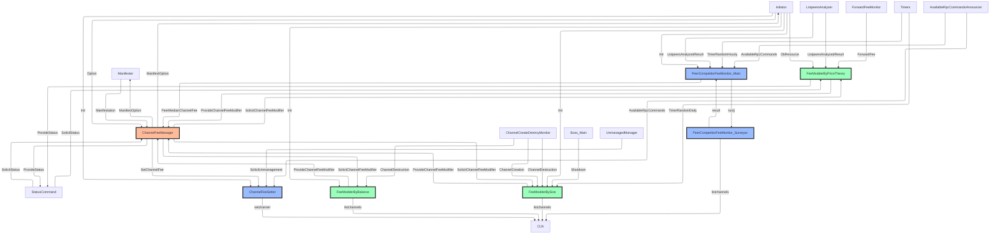

# CLBOSS Fee Setting

```mermaid
   %%{init: {"flowchart": {"defaultRenderer": "elk"}} }%%

   flowchart TB

   style ChannelFeeManager fill:#fb9,stroke:#333,stroke-width:4px
   Manifester-->|Manifestation|ChannelFeeManager
   Initiator-->|Option|ChannelFeeManager
   PeerCompetitorFeeMonitor_Main-->|PeerMedianChannelFee|ChannelFeeManager
   StatusCommand-->|SolicitStatus|ChannelFeeManager
   ChannelFeeManager-->|ManifestOption|Initiator
   ChannelFeeManager-->|ManifestOption|Manifester
   ChannelFeeManager-->|ProvideStatus|StatusCommand
   ChannelFeeManager-->|SetChannelFee|ChannelFeeSetter

   style FeeModderByBalance fill:#9fb,stroke:#333,stroke-width:4px
   Initiator-->|Init|FeeModderByBalance
   ChannelCreateDestroyMonitor-->|ChannelDestruction|FeeModderByBalance
   ChannelFeeManager-->|SolicitChannelFeeModifier|FeeModderByBalance
   FeeModderByBalance-->|listchannels|CLN
   FeeModderByBalance-->|ProvideChannelFeeModifier|ChannelFeeManager

   style FeeModderByPriceTheory fill:#9fb,stroke:#333,stroke-width:4px
   Initiator-->|DbResource|FeeModderByPriceTheory
   ListpeersAnalyzer-->|ListpeersAnalyzedResult|FeeModderByPriceTheory
   ForwardFeeMonitor-->|ForwardFee|FeeModderByPriceTheory
   StatusCommand-->|SolicitStatus|FeeModderByPriceTheory
   ChannelFeeManager-->|SolicitChannelFeeModifier|FeeModderByPriceTheory
   FeeModderByPriceTheory-->|ProvideChannelFeeModifier|ChannelFeeManager
   FeeModderByPriceTheory-->|ProvideStatus|StatusCommand

   style FeeModderBySize fill:#9fb,stroke:#333,stroke-width:4px
   Initiator-->|Init|FeeModderBySize
   Timers-->|TimerRandomDaily|FeeModderBySize
   ChannelCreateDestroyMonitor-->|ChannelCreation|FeeModderBySize
   ChannelCreateDestroyMonitor-->|ChannelDestruction|FeeModderBySize
   Boss_Main-->|Shutdown|FeeModderBySize
   ChannelFeeManager-->|SolicitChannelFeeModifier|FeeModderBySize
   FeeModderBySize-->|listchannels|CLN
   FeeModderBySize-->|ProvideChannelFeeModifier|ChannelFeeManager

   style ChannelFeeSetter fill:#9bf,stroke:#333,stroke-width:4px
   Initiator-->|Init|ChannelFeeSetter
   AvailableRpcCommandsAnnouncer-->|AvailableRpcCommands|ChannelFeeSetter
   UnmanagedManager-->|SolicitUnmanagement|ChannelFeeSetter
   ChannelFeeSetter-->|setchannel|CLN

   style PeerCompetitorFeeMonitor_Main fill:#9bf,stroke:#333,stroke-width:4px
   Initiator-->|Init|PeerCompetitorFeeMonitor_Main
   ListpeersAnalyzer-->|ListpeersAnalyzedResult|PeerCompetitorFeeMonitor_Main
   Timers-->|TimerRandomHourly|PeerCompetitorFeeMonitor_Main
   AvailableRpcCommandsAnnouncer-->|AvailableRpcCommands|PeerCompetitorFeeMonitor_Main
   PeerCompetitorFeeMonitor_Main-->|"run()"|PeerCompetitorFeeMonitor_Surveyor

   style PeerCompetitorFeeMonitor_Surveyor fill:#9bf,stroke:#333,stroke-width:4px
   PeerCompetitorFeeMonitor_Surveyor-->|listchannels|CLN
   PeerCompetitorFeeMonitor_Surveyor-->|result|PeerCompetitorFeeMonitor_Main
```
