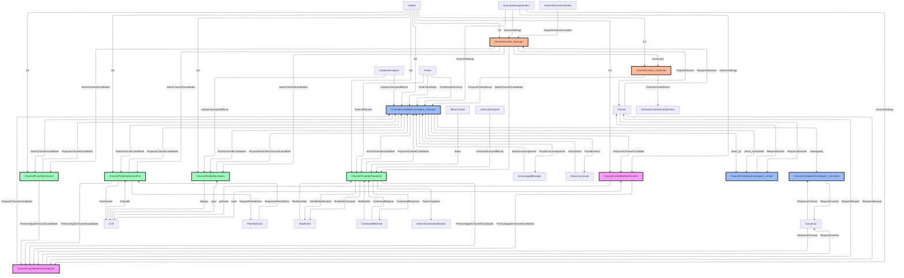

   # CLBOSS Channel Creation

```mermaid
   %%{init: {"flowchart": {"defaultRenderer": "elk"}} }%%

   graph TB

   style ChannelFinderByDistance fill:#9fb,stroke:#333,stroke-width:4px
   Initiator-->|Init|ChannelFinderByDistance
   ChannelCandidateInvestigator_Manager-->|SolicitChannelCandidates|ChannelFinderByDistance
   ChannelCreator_Manager-->|SolicitChannelCandidates|ChannelFinderByDistance
   ChannelFinderByDistance-->|ProposeChannelCandidates|ChannelCandidateInvestigator_Manager
   ChannelFinderByDistance-->|PreinvestigateChannelCandidates|ChannelCandidatePreinvestigator

   style ChannelFinderByEarnedFee fill:#9fb,stroke:#333,stroke-width:4px
   Initiator-->|Init|ChannelFinderByEarnedFee
   ChannelCandidateInvestigator_Manager-->|SolicitChannelCandidates|ChannelFinderByEarnedFee
   ChannelCreator_Manager-->|SolicitChannelCandidates|ChannelFinderByEarnedFee
   ChannelFinderByEarnedFee-->|listchannels|CLN
   CLN-->|channels|ChannelFinderByEarnedFee
   ChannelFinderByEarnedFee-->|RequestPeerMetrics|PeerMetrician
   PeerMetrician-->|ResponsePeerMetrics|ChannelFinderByEarnedFee
   ChannelFinderByEarnedFee-->|ProposeChannelCandidates|ChannelCandidateInvestigator_Manager
   ChannelFinderByEarnedFee-->|PreinvestigateChannelCandidates|ChannelCandidatePreinvestigator

   style ChannelFinderByListpays fill:#9fb,stroke:#333,stroke-width:4px
   Initiator-->|Init|ChannelFinderByListpays
   ListpeersAnalyzer-->|ListpeersAnalyzedResult|ChannelFinderByListpays
   ChannelCandidateInvestigator_Manager-->|SolicitChannelCandidates|ChannelFinderByListpays
   ChannelCreator_Manager-->|SolicitChannelCandidates|ChannelFinderByListpays
   ChannelFinderByListpays-->|listpays|CLN
   CLN-->|pays|ChannelFinderByListpays
   ChannelFinderByListpays-->|ProposePatronlessChannelCandidate|ChannelCandidateInvestigator_Manager

   style ChannelFinderByPopularity fill:#9fb,stroke:#333,stroke-width:4px
   Initiator-->|Init|ChannelFinderByPopularity
   ChannelCandidateInvestigator_Manager-->|SolicitChannelCandidates|ChannelFinderByPopularity
   ChannelCreator_Manager-->|SolicitChannelCandidates|ChannelFinderByPopularity
   BlockTracker-->|Block|ChannelFinderByPopularity
   Timers-->|Timer10Minutes|ChannelFinderByPopularity
   Manifester-->|Manifestation|ChannelFinderByPopularity
   CommandReceiver-->|Notification|ChannelFinderByPopularity
   CommandReceiver-->|CommandRequest|ChannelFinderByPopularity
   ListfundsAnalyzer-->|ListfundsAnalyzedResult|ChannelFinderByPopularity
   ChannelFinderByPopularity-->|ManifestNotification|Manifester
   ChannelFinderByPopularity-->|ManifestCommand|Manifester
   ChannelFinderByPopularity-->|CommandResponse|CommandReceiver
   ChannelFinderByPopularity-->|ProposeChannelCandidates|ChannelCandidateInvestigator_Manager
   ChannelFinderByPopularity-->|PreinvestigateChannelCandidates|ChannelCandidatePreinvestigator
   ChannelFinderByPopularity-->|TaskCompletion|InternetConnectionMonitor

   style ChannelCandidatePreinvestigator fill:#f9f,stroke:#333,stroke-width:4px
   Connector-->|ResponseConnect|ChannelCandidatePreinvestigator
   AmountSettingsHandler-->|AmountSettings|ChannelCandidatePreinvestigator
   ChannelCandidatePreinvestigator-->|RequestConnect|Connector
   ChannelCandidatePreinvestigator-->|ProposeChannelCandidates|ChannelCandidateInvestigator_Manager
   ChannelCandidatePreinvestigator-->|RequestDowser|Dowser
   Dowser-->|ResponseDowser|ChannelCandidatePreinvestigator

   style ChannelCandidateInvestigator_Manager fill:#9bf,stroke:#333,stroke-width:4px
   Initiator-->|Init|ChannelCandidateInvestigator_Manager
   AmountSettingsHandler-->|AmountSettings|ChannelCandidateInvestigator_Manager
   UnmanagedManager-->|SolicitUnmanagement|ChannelCandidateInvestigator_Manager
   Timers-->|TimerTwiceDaily|ChannelCandidateInvestigator_Manager
   Timers-->|TimerRandomHourly|ChannelCandidateInvestigator_Manager
   ListpeersAnalyzer-->|ListpeersAnalyzedResult|ChannelCandidateInvestigator_Manager
   StatusCommand-->|SolicitStatus|ChannelCandidateInvestigator_Manager
   ChannelCandidateInvestigator_Manager-->|ProvideUnmanagement|UnmanagedManager
   ChannelCandidateInvestigator_Manager-->|PatronizeChannelCandidate|ChannelCandidateMatchmaker
   ChannelCandidateInvestigator_Manager-->|ProvideStatus|StatusCommand

   style ChannelCandidateInvestigator_Janitor fill:#9bf,stroke:#333,stroke-width:4px
   ChannelCandidateInvestigator_Manager-->|clean_up|ChannelCandidateInvestigator_Janitor
   ChannelCandidateInvestigator_Manager-->|check_acceptable|ChannelCandidateInvestigator_Janitor
   ChannelCandidateInvestigator_Janitor-->|RequestDowser|Dowser
   Dowser-->|ResponseDowser|ChannelCandidateInvestigator_Janitor

   style ChannelCandidateInvestigator_Gumshoe fill:#9bf,stroke:#333,stroke-width:4px
   ChannelCandidateInvestigator_Manager-->|"investigate()"|ChannelCandidateInvestigator_Gumshoe
   Connector-->|ResponseConnect|ChannelCandidateInvestigator_Gumshoe
   ChannelCandidateInvestigator_Gumshoe-->|RequestConnect|Connector

   style ChannelCandidateMatchmaker fill:#f9f,stroke:#333,stroke-width:4px
   AmountSettingsHandler-->|AmountSettings|ChannelCandidateMatchmaker
   Initiator-->|Init|ChannelCandidateMatchmaker
   ChannelCandidateMatchmaker-->|PreinvestigateChannelCandidates|ChannelCandidatePreinvestigator
   ChannelCandidateMatchmaker-->|getroute|CLN
   CLN-->|route|ChannelCandidateMatchmaker

   style ChannelCreator_Manager fill:#fb9,stroke:#333,stroke-width:4px
   AmountSettingsHandler-->|AmountSettings|ChannelCreator_Manager
   Initiator-->|Init|ChannelCreator_Manager
   ChannelCreationDecider-->|RequestChannelCreation|ChannelCreator_Manager
   ChannelCreator_Manager-->|RequestDowser|Dowser
   Dowser-->|ResponseDowser|ChannelCreator_Manager

   style ChannelCreator_Carpenter fill:#fb9,stroke:#333,stroke-width:4px
   Initiator-->|Init|ChannelCreator_Carpenter
   ChannelCreator_Manager-->|"construct()"|ChannelCreator_Carpenter
   ChannelCreator_Carpenter-->|ChannelCreateResult|ChannelCandidateInvestigator_Manager
   ChannelCreator_Carpenter-->|ChannelCreateResult|ChannelCreateDestroyMonitor
```
