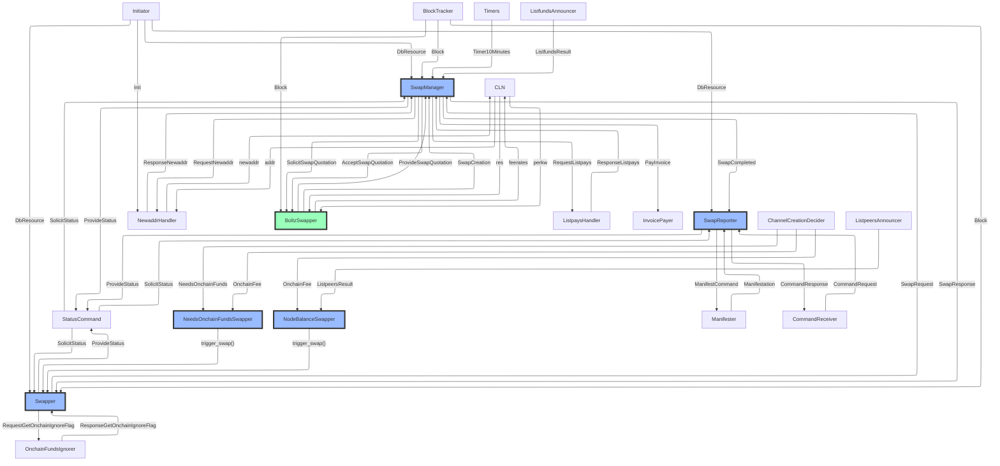

   # CLBOSS Offchain-to-onchain swap

```mermaid
   %%{init: {"flowchart": {"defaultRenderer": "elk"}} }%%

   graph TB

   Initiator-->|Init|NewaddrHandler
   SwapManager-->|RequestNewaddr|NewaddrHandler
   NewaddrHandler-->|newaddr|CLN
   CLN-->|addr|NewaddrHandler
   NewaddrHandler-->|ResponseNewaddr|SwapManager

   style BoltzSwapper fill:#9fb,stroke:#333,stroke-width:4px
   BlockTracker-->|Block|BoltzSwapper
   SwapManager-->|SolicitSwapQuotation|BoltzSwapper
   SwapManager-->|AcceptSwapQuotation|BoltzSwapper
   BoltzSwapper-->|ProvideSwapQuotation|SwapManager
   BoltzSwapper-->|SwapCreation|SwapManager
   BoltzSwapper-->|feerates|CLN
   CLN-->|perkw|BoltzSwapper
   CLN-->|res|BoltzSwapper

   style SwapManager fill:#9bf,stroke:#333,stroke-width:4px
   Initiator-->|DbResource|SwapManager
   Timers-->|Timer10Minutes|SwapManager
   ListpaysHandler-->|ResponseListpays|SwapManager
   ListfundsAnnouncer-->|ListfundsResult|SwapManager
   BlockTracker-->|Block|SwapManager
   StatusCommand-->|SolicitStatus|SwapManager
   SwapManager-->|PayInvoice|InvoicePayer
   SwapManager-->|RequestListpays|ListpaysHandler
   SwapManager-->|ProvideStatus|StatusCommand
   SwapManager-->|SwapCompleted|SwapReporter

   style NeedsOnchainFundsSwapper fill:#9bf,stroke:#333,stroke-width:4px
   ChannelCreationDecider-->|OnchainFee|NeedsOnchainFundsSwapper
   ChannelCreationDecider-->|NeedsOnchainFunds|NeedsOnchainFundsSwapper
   NeedsOnchainFundsSwapper-->|"trigger_swap()"|Swapper

   style NodeBalanceSwapper fill:#9bf,stroke:#333,stroke-width:4px
   ChannelCreationDecider-->|OnchainFee|NodeBalanceSwapper
   ListpeersAnnouncer-->|ListpeersResult|NodeBalanceSwapper
   NodeBalanceSwapper-->|"trigger_swap()"|Swapper

   style SwapReporter fill:#9bf,stroke:#333,stroke-width:4px
   Initiator-->|DbResource|SwapReporter
   StatusCommand-->|SolicitStatus|SwapReporter
   Manifester-->|Manifestation|SwapReporter
   CommandReceiver-->|CommandRequest|SwapReporter
   SwapReporter-->|ProvideStatus|StatusCommand
   SwapReporter-->|ManifestCommand|Manifester
   SwapReporter-->|CommandResponse|CommandReceiver

   style Swapper fill:#9bf,stroke:#333,stroke-width:4px
   Initiator-->|DbResource|Swapper
   BlockTracker-->|Block|Swapper
   StatusCommand-->|SolicitStatus|Swapper
   OnchainFundsIgnorer-->|ResponseGetOnchainIgnoreFlag|Swapper
   SwapManager-->|SwapResponse|Swapper
   Swapper-->|RequestGetOnchainIgnoreFlag|OnchainFundsIgnorer
   Swapper-->|ProvideStatus|StatusCommand
   Swapper-->|SwapRequest|SwapManager
```
