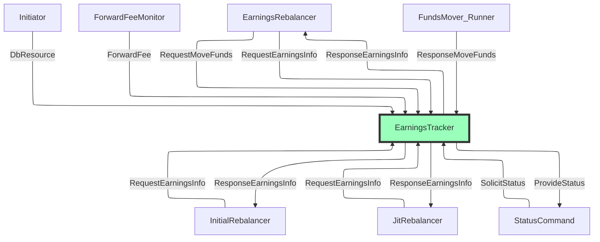

# CLBOSS Earnings Tracker

```mermaid
   %%{init: {"flowchart": {"defaultRenderer": "elk"}} }%%

   flowchart TB

   style EarningsTracker fill:#9fb,stroke:#333,stroke-width:4px
   Initiator-->|DbResource|EarningsTracker
   ForwardFeeMonitor-->|ForwardFee|EarningsTracker
   EarningsRebalancer-->|RequestMoveFunds|EarningsTracker
   FundsMover_Runner-->|ResponseMoveFunds|EarningsTracker
   EarningsRebalancer-->|RequestEarningsInfo|EarningsTracker
   InitialRebalancer-->|RequestEarningsInfo|EarningsTracker
   JitRebalancer-->|RequestEarningsInfo|EarningsTracker
   StatusCommand-->|SolicitStatus|EarningsTracker
   EarningsTracker-->|ResponseEarningsInfo|EarningsRebalancer
   EarningsTracker-->|ResponseEarningsInfo|InitialRebalancer
   EarningsTracker-->|ResponseEarningsInfo|JitRebalancer
   EarningsTracker-->|ProvideStatus|StatusCommand
```
